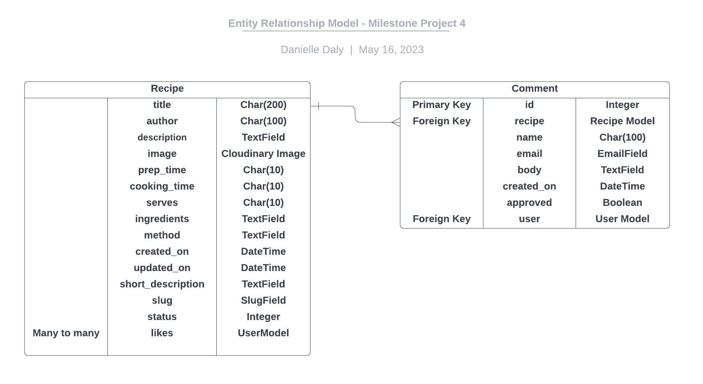

# Easy Eats

## Portfolio Project 4

Easy Eats is a recipe website aimed at anyone who is looking for inspiration and ideas for their next meal. It includes the most recent recipes featured on the homepage, a link to the full recipe details and all recipes available. 

On each recipe the user can view the recipe title,how many people the recipe serves, the cooking time as well as a short description of the recipe. 

The main function of this website is to ....

This project aims to build a full-stack web application using the python framework Django, Cloudinary database, HTML, CSS and Javascript
 
My application features ....with full CRUD capabilities, a comment feature, a like feature, user- sign up, user login and an admin section.

Admin login details included ....
For the assessor, I have included the admin login details in the comments section when submitting the project.

This project aims to build a full-stack web application using Django, HTML, CSS and javascript.
### View the live project here:

## User Stories

### As a user I want to be able to navigate the website using the navigation bar links, so that I can easily access all areas of the site

- The Navigation Bar is clearly displayed on the top right hand corner of the page.
- The Navigation Bar contains links to the other pages on the webiste.
- The user can access the Home, Recipes, Login and Register pages by clicking on their link.
- The user can also access the homepage from any of the website pages by clicking on the site logo located on the top left-hand side of the page.

### As a user I want to see some information when I open the homepage, so that I know what the website is about

- The name of the website "Easy Eats" is clearly displayed on the homepage.
- Below the name is a short description of the website's purpose and what the user can expect to find on the website.
- Below the description, the user can see a selection of the latest recipes from the website.  

### As a user I want to be able to view the most recent recipes on the homepage, so I can see if there are any recipes that I am interested in

- A selection of the latest recipes are displayed on the homepage so that the user can see the most recent additions to the website.
- For each recipe in this section the user can view an image of the recipe, the recipe title, the cooking time, how many people the recipe will serve and a short description of the recipe.
- Each recipe on the home page contains a "READ MORE" buttton which will bring the user to the full recipe page.

### As a user I want to be able to view full recipe details, so that I can find out more about a particular recipe

- Full recipes can be accessed by clicking on the "Recipes" link in the Navigation Bar, and clicking on a recipe.
- They can also be accessed by clicking on the "READ MORE" button on an individual recipe on the homepage.
- Users can click on a recipe on the "All Recipes" page to view full recipe details and instructions.

### As a user I want to be able to access a list of all recipes from the homepage, so that I can browse recipes for inspiration

- Users can access a list of all recipes by clicking on the "Recipes" link in the Navigation Bar.
- Users can also access a list of all recipes by clicking on the "All Recipes" link at the bottom of the homepage.

### As a user I want to be able to view comments on each individual recipe, so that I can gain insights into other peoples opinion about the recipe

- All users, regardless of whether they are registered users or not, can view comments left on each individual recipe.
- Comments are located below each recipe.
- Comments contain details of who has left the comment, the comment content as well as the date and time the comment was left.

### As a user I want to be able to see how long a recipe would take to make, so that I can decide if I have time to make this recipe

- The cooking time is displayed for each recipe.
- The cooking time is displayed clearly above the description for each recipe.
- It is visible on all pages without having to click into the recipe to view.
- It also contains an icon to make this information stand out more for the user.

### As a user I want to be able to see how many people each recipe serves, so that I can decide if the recipe is suitable for my requirements

- The number of people served by is displayed for each recipe.
- The number of people served is displayed clearly above the description and below the cooking time for each recipe.
- It is visible on all pages without having to click into the recipe to view.
- It also contains an icon to make this information stand out more for the user.

### As a user I want to be able to view the number of likes each recipe has received, so that I can see if people think this recipe is good

- The likes each recipe has received are displayed below each recipe.
- Registered users can like and unlike any recipe.
- All users, whether registered users or not can view the likes a recipe has received.

### As a user I want to be able to register and create an account so that I can leave comments and likes on recipes

- Users can register easily by clicking on the "Register" link in the navigtion bar.
- In order to register users will be asked to fill in a form containing their username, email address and password.  
- Once registered, the user will be able to log in and leave comments and likes on recipes.

### As a user I want to receive confirmation that I have registered successfully, so that I know the registration is complete and I can now log into the site

- Once a user has registered they will receive a message to advise that they have registered successfully.
- This message will appear on screen and give immediate feedback to the user and will prompt them to log in.

### As a registered user I want to receive confirmation that I have logged in successfully, so I know I will be able to leave comments

- When a user logs into the site, a message will display advising that they have logged in successfully.
- This message will disappear automatically after serveral seconds.

### As a registered user I want to receive confirmation that I have logged out successfully, so that I know that I can leave the site securely

- When a user logs out of the site, a message will display advising that they have logged out successfully.
- This message will disappear automatically after serveral seconds.

### As a registered user I want to be able to log into my account easily, so that I can leave comments and likes

- Registered users can login easily by clicking on the "Login" link in the navigtion bar.
- On the Login page the user will be asked to enter their username and password and click the "Login" button.
- When a user logs into the site, a message will display advising that they have logged in successfully.
- This message will disappear automatically after serveral seconds.
- Once logged in the user will be able to leave comments and likes on recipes.

### As a registered user I want to be able to leave comments on recipes, so that other users can see my opinion on a recipe

- Registered users can leave comments on recipes.
- Once a comment is submitted it will sent for approvel.
- Registered users will receive a message advising that their comment has been sent for approval.
- Once approved their comment will display on the website.
- The comment will contain details of who has left the comment, the comment content as well as the date and time the comment was left.

### As a registered user I want to be able to “like” / “unlike” recipes, so that I can show my approval of a recipe

- Registered users can like recipes.
- Registered users can unlike recipes.
- Once a user likes a recipe, the total number of likes will increase.
- Once a user unlikes a recipe, the total number of likes will decrease.

### As an admin I want to be able to approve comments before they appear on a recipe, so that I can remove any offensive content

- Comments can be viewed by an admin before they are displayed on the website.
- Once comments are approved they will display on the website.
- If comments are not approved they will not be visible on the website.
- Approval for comments ensures that no offensive content will be added to the website.

### As an admin I want to be able to delete comments from recipes, so that I can remove any offensive content

- An admin can delete comments made by any user.
- This is to ensure comments do not contain any offensive content.

### As an admin I want to be able to create recipes, so that I can add and manage content for the website

- Recipes/ website content can be created by the site admin and added to the website.

### As an admin I want to be able to create and save draft recipes, so that I can save my work and finish it later

- Draft recipes can be creates and saved.
- This allows the site admin to work on content for the website, save their changes and come back to it again later.

### As an admin I want to be able to update recipes, so that I can manage/ improve content for the website

- Recipe content/ details can be amended or updated at any point by the site admin.
- This allows them them to fix errors, improve recipes and take into account feedback from comments.  

### As an admin I want to be able to delete recipes, so that unpopular/older receipes are no longer available

- Recipes can be deleted at any point by the site admin.
  
## Wireframes

### Wireframes for Desktop

I have created wireframes using Balsamiq for Desktop, Tablet and Phone

- [Homepage](readme-images/wireframes/desktop/homepage-desktop.png)
- [All Recipes](readme-images/wireframes/desktop/all-recipes-desktop.png)
- [Recipe Logged In](readme-images/wireframes/desktop/recipe-logged-in-desktop.png)
- [Recipe Not Logged In](readme-images/wireframes/desktop/recipe-not-logged-in-desktop.png)
- [Register](readme-images/wireframes/desktop/register-desktop.png)
- [Login](readme-images/wireframes/desktop/login-desktop.png)

### Wireframes for Tablet

- [Homepage](readme-images/wireframes/tablet/homepage-tablet.png)
- [All Recipes](readme-images/wireframes/tablet/all-recipes-tablet.png)
- [Recipe Logged In](readme-images/wireframes/tablet/recipe-logged-in-tablet.png)
- [Recipe Not Logged In](readme-images/wireframes/tablet/recipe-not-logged-in-tablet.png)
- [Register](readme-images/wireframes/tablet/register-tablet.png)
- [Login](readme-images/wireframes/tablet/login-tablet.png)

### Wireframes for Phone

- [Homepage](readme-images/wireframes/phone/homepage-phone.png)
- [All Recipes](readme-images/wireframes/phone/all-recipes-phone.png)
- [Recipe Logged In](readme-images/wireframes/phone/recipe-logged-in-phone.png)
- [Recipe Not Logged In](readme-images/wireframes/phone/recipe-not-logged-in-phone.png)
- [Register](readme-images/wireframes/phone/register-phone.png)
- [Login](readme-images/wireframes/phone/login-phone.png)

## Database Models and Schema

### Recipes

- The Recipes Model contains the information about each recipe on the website.
- The title field is the name of the recipe, and is unique.
- It contains a one-to-many relationship with the Comment Model.
- The title field is the foreign key for this relationship.
It contains a many-to-one relationship with the Category Model.
- The category field is the foreign key for this relationship.
- It contains a many-to-many key for Likes.

### Comments

- The Comments Model contains the content of each comment made on each recipe.
- It contains a many-to-one relationship with the Recipe Model.
- The id field is the primary key for this relationship.

### Category

- The Category model contains an id and category_name fields.
- It contains a one-to-many relationship with the Recipe Model.
- The id field is the primary key for this relationship.

## Database Schema

My database schema was created using Lucid Chart and is displayed in the below diagram.

 

## Existing features

### The Navigation Bar

#### Image of Desktop Navigation Bar - Logged In 

 

#### Image of Tablet Navigation Bar - Not Logged In 

 

 #### Image of Desktop Navigation Bar - Not Logged In 

 

The Navigation Bar for this website consists of the the following:

When logged in the navigation bar will display: Home, Recipes & Logout

When not logged in the navigation bar will display: Home, Recipes, Register & Login

Login, Logout and Register sections were created using Django allauth.

There are located on the top right- hand side of the page and enables the user to easily navigate to their desired location on the website.

Each section on the navbar changes color when the user hovers over it. The hover color used is consistent throughout for hover states used throughout the website.

On the top-left hand side of the navigation bar, the website logo is displayed. This contains the name of the website Easy Eats and an icon of a plate and utensils. This indicates to the user what the site will be about. 

The Easy Eats logo contains a link to the homepage which can be accessed from any page to bring hte user back to the homepage when clicked and allows them to easily navigate the site. 

The colors of the logo match the colors used throughout the site. 

The navigation bar is the same across all pages in order to provide ease of use and consistency to the user. It also uses a contrasting colour scheme which allows the user to quickly navigate through the website.

### The Navigation Bar - Tablet and Mobile View

The Navigation Bar is displayed as a burger menu toggle for Tablet and Mobile views. 

When a user clicks on the toggle the options are displayed below, towards the right hand side of the page.

#### Image of Tablet Navigation Bar - Logged In 

 

 #### Image of Mobile Navigation Bar - Logged In 

 
 

 #### Image of Mobile Navigation Bar - Not Logged In 

 
 
 
### Homepage 

The Hero Section

The Hero Section on the homepage consists of the main image featured on the page with a text overlay which includes a description of what the user can expect to find on the website as well as the website name Easy Eats. 

The Hero Image contains animation which makes it appear as though it's moving forward on the page. 

#### Image of the Hero Image

 

### Latest Recipes

#### Image of Latest Recipes

 

 Below the Hero Image are a selection of the Latest Recipes. These are ordered with the newest recipe appearing first.

 The recipes on this page contain a brief overview of the recipe designed to grab the users attention. 

 Each recipe in this section contains an image of the recipe,,the recipe title a short description of the recipe, the cooking time, how many peple this recipe serves and how many likes it has. Details of the full recipe can be accessed by 3 links on the recipe - the recipe image, the recipe title and a view recipe link at the bottom. All of which brings to user to a page where they can view the full recipe details. The cooking time, number of people served and likes all contain an icon to allow the user to scan the recipe quickly for the information they require. Each recipe also contains, the date and time that the recipe was uploaded.

 ### Full Recipe Page

 #### Image of Full Recipe Page

 
 
 From any of the recipes on the homepage, located under the Latest Recipes heading, users can access full detail about any of the recipes by clicking on the links provided.

 On each recipe these are located in the recipe image, the recipe title and the vew recipe link.
 
 Once a user clcks on the link they are brought to a page that contains full details of the recipe that the user has clicked on. 

 #### Image of Full Recipe Page - Image and Description

 

 The top section of the page contains an image representing the recipe on the left. This also contains animation. On the right contains some information about the recipe. The design and infomration provided mirrors the shorter version of hte recipe displayed on the homepage somewhat to achieve consistency in user experience. The details include the recipe heading, the cooking time with icon and numebr of people served with icon. Below is also a description as in the recipe listing on the homepage but this description has been expanded and contains more detail. This section also displays likes and comments.

 ### Like Recipe

A logged in user can also like recipes. 

If a user is logged in they will see an option called "Like this Recipe?". This is displayed by a heart outline. If a user clicks on the heart icon, it adds a like to the recipe. Once a user has liked a recipe the heart icon changes to display that the recipe has already been liked. A logged in user can also unlike a recipe by clicking on the heart icon again. Once the user unlikes a recipe, the heart icon reverts to a heart outline. 

 #### Image of Like Recipe

 

  #### Image of Unlike Recipe

 

If a user is not logged in they canot like or unlike a recipe. In this instance instead of displaying "Like this recipe?", the number of likes a recipe has received is displayed instead. 

 #### Image of Number of Likes

 

 #### Image of Full Recipe Page - Image and Description

 
 

 #### Image of Full Recipe Page - Ingredients and Method

 
 
 The next section of the page contains the recipe ingredients and method. On the left the ingredients are displayed, on the right the method. These are displayed in contrasting colours to ensable users to eaiily find the infomation they are looking for.

### Comments Section

 The final section on the page is the comments section. Here users can view any comments that have been made about a particular recipe. All users can view comments made on a recipe regardless of whether they are a registered user and logged in or not. 

 Each comment contains the name of the user that has left the comment, the time and date the comment was left. 

#### Image of a Comment

 

 If a user is not logged in they can view only the comments that have been left but they cannot interact with the site themselves by leaving comments.

 Logged in/ registered users can leave their own comments on a recipe. When a user is logged in their view is slightly different. Below the displayed comments there is an option to leave a comment.

#### Image of Comments Section - Leave Comment

 

 Once a user has left a comment, the comment will go for approval by the site admin. This allows the site admin to control the content visible on tee website and to delete any comments that are deemed offensive or inappropriate.

 A pop up message is displayed to advise the logged in user is advised that their comment has gone for approval.buttons Once approved their comment will display on the site.

#### Image of Comments Section - Comment Approval Message

 

 A logged in user can also edit and delete their own comments. They can do this by clicking on the edit or delete buttons on the comments themselves. A user can only edit/ delete comments that they have made themselves. They cannot edit or delete comments made by other people.

 If a user is logged in the edit and delete buttins are only visible on their own comments bit not on others.

#### Image of Comments Section - Edit and Delete Comments

 

 ### Editing a Comment

 A logged in users can edit their own comment by clicking on the Edit buttton located on their previous comments. 

 Once they click on the Edit button, their previous comment/ the comment they have chosen to edit is displayed in the comment box. The user can edit their comment. An update button is displayed below which allows them to save the changes to their comments.

#### Image of Edit Comments Section

 

 ### Deleting a Comment

 A logged in user can delete a comment. They can only delete comments they have made themselves. To delete a comment the user must click on the Delete button on the comment they wish to delete. They are prompted with a warning message which asks them "Are you sure you want to delete your comment". below this warning there are 2 buttons displaye - Cancel and Delete. If a user clicks cancel they are brought back to the comments section. If they click delet their comment isdeleted and removed from the list of displyed comments

 #### Image of Delete Comment Warning

 

### Link to Recipes Page - "All Recipes" button

#### Image of "All Recipes" button
  
 

 At the botton of the homepage the "All Recipes" button is located. This links to the recipes page wherethe user can view all the recipes that are available on the website.

