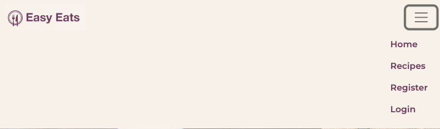
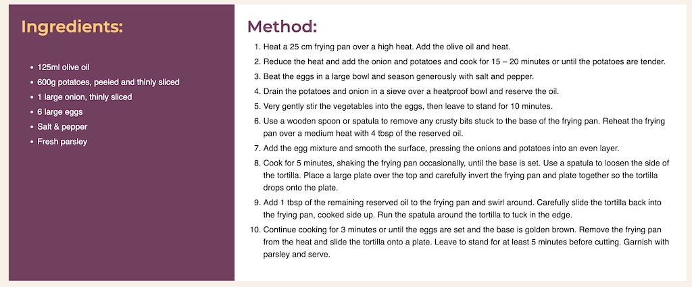

# Easy Eats

## Portfolio Project 4

Easy Eats is a recipe website aimed at anyone who is looking for inspiration and ideas for their next meal. Site Users can browse the latest recipes on the homepage, all available recipes on the Recipes page and click on a recipe for more detail.

They can also easily access basic information on a recipe from the homepage and recipes page without having to view the full recipe detail. Each recipe listing contains an image of the recipe, the recipe title, how many people the recipe serves, the cooking time, how many likes this recipe has received from users, the date and time the recipe was posted as well as a short description of the recipe.

Easy Eats is a full-stack web application using the Python Django Framework, the Cloudinary database, HTML, CSS and JavaScript.

It provides full CRUD capabilities to the user, accessible from the front end without having to access the admin section. Users can create, read, update and delete their own comments when they are logged in. They can also read comments from other users and further interact with the website by 'liking' and 'unliking' a recipe. Users can also see the total number of likes a recipe has received.

Easy Eats also has an Administration section. The admin user can add, update and delete content on the website. They can also manage comments by approving or deleting comments submitted by users. 

For the assessor, I have included the admin login details in the comments section when submitting the project.

### View the live project here:

## User Stories

### As a user I want to be able to navigate the website using the navigation bar links, so that I can easily access all areas of the site

- The Navigation Bar is clearly displayed on the top right hand corner of the page.
- The Navigation Bar contains links to the other pages on the webiste.
- The user can access the Home, Recipes, Login and Register pages by clicking on their link.
- The user can also access the homepage from any of the website pages by clicking on the site logo located on the top left-hand side of the page.

### As a user I want to see some information when I open the homepage, so that I know what the website is about

- The name of the website "Easy Eats" is clearly displayed on the homepage.
- Below the name is a short description of the website's purpose and what the user can expect to find on the website.
- Below the description, the user can see a selection of the latest recipes from the website.  

### As a user I want to be able to view the most recent recipes on the homepage, so I can see if there are any recipes that I am interested in

- A selection of the latest recipes are displayed on the homepage so that the user can see the most recent additions to the website.
- For each recipe in this section the user can view an image of the recipe, the recipe title, the cooking time, how many people the recipe will serve, the time and date the recipe was added, the number of likes the recipe has received and a short description of the recipe.
- Each recipe on the home page contains a "View More" link to the full-recipe. The recipe image and title also contain a link to the full-recipe.

### As a user I want to be able to view full recipe details, so that I can find out more about a particular recipe

- Full recipe details can be accessed by clicking on a recipe listing on the homepage or recipes page.
- Each recipe listing contains 3 links to that recipe. These are located in the recipe image, the recipe title and the 'view more' link.

### As a user I want to be able to access a list of all recipes from the homepage, so that I can browse recipes for inspiration

- Users can access a list of all recipes by clicking on the "Recipes" link in the Navigation Bar.
- Users can also access a list of all recipes by clicking on the "All Recipes" link at the bottom of the homepage.

### As a user I want to be able to view comments on each individual recipe, so that I can gain insights into other peoples opinion about the recipe

- All users, regardless of whether they are registered users or not, can view comments left on each individual recipe.
- Comments are located below each recipe.
- Comments contain details of who has left the comment, the comment content as well as the date and time the comment was left.

### As a user I want to be able to see how long a recipe would take to make, so that I can decide if I have time to make this recipe

- The cooking time is displayed for each recipe.
- The cooking time is displayed clearly above the description for each recipe.
- It is visible on all pages without having to click into the recipe to view.
- It also contains an icon to make this information stand out more for the user.

### As a user I want to be able to see how many people each recipe serves, so that I can decide if the recipe is suitable for my requirements

- The number of people a recipe serves is displayed for each recipe.
- The number of people served is displayed clearly above the description and below the cooking time for each recipe.
- It is visible on all pages without having to click into the recipe to view.
- It also contains an icon to make this information stand out more for the user.

### As a user I want to be able to view the number of likes each recipe has received, so that I can see if people think this recipe is good

- The likes each recipe has received are displayed below each recipe.
- Registered users can like and unlike any recipe.
- All users, whether registered users or not can view the likes a recipe has received.

### As a user I want to be able to register and create an account so that I can leave comments and likes on recipes

- Users can register easily by clicking on the "Register" link in the navigtion bar.
- In order to register users will be asked to fill in a form containing their username, email address and password.  
- The email address is on the form but it is not required in order to register. If a user prefers they can sign up using a username and password.
- Once registered, the user will be able to log in and leave comments and likes on recipes.

### As a user I want to receive confirmation that I have registered/ signed in successfully, so that I know the registration is complete and I can now access the site

- Once a user has registered they will receive a message to advise that they have registered successfully.
- This message will appear on screen and give immediate feedback to the user.

### As a registered user I want to receive confirmation that I have logged in successfully, so I know I will be able to leave comments

- When a user logs into the site, a message will display advising them that they have logged in successfully.
- This message will disappear automatically after serveral seconds.

### As a registered user I want to receive confirmation that I have logged out successfully, so that I know that I can leave the site securely

- When a user logs out of the site, a message will display advising them that they have logged out successfully.
- This message will disappear automatically after serveral seconds.

### As a registered user I want to be able to log into my account easily, so that I can leave comments and likes

- Registered users can login easily by clicking on the "Login" link in the navigtion bar.
- On the Login page the user will be asked to enter their username and password and click the "Login" button.
- When a user logs into the site, a message will display advising them that they have logged in successfully.
- This message will disappear automatically after serveral seconds.
- Once logged in the user will be able to leave comments and likes on recipes.

### As a registered user I want to be able to leave comments on recipes, so that other users can see my opinion on a recipe

- Registered users can leave comments on recipes.
- Once a comment is submitted it will be sent for approval.
- Registered users will receive a message advising that their comment has been sent for approval.
- Once approved their comment will display on the website.
- The comment will contain details of who has left the comment, the comment content as well as the date and time the comment was left.

### As a registered user I want to be able to “like” / “unlike” recipes, so that I can show my approval of a recipe

- Registered users can like recipes.
- Registered users can unlike recipes.
- Once a user likes a recipe, the total number of likes will increase.
- Once a user unlikes a recipe, the total number of likes will decrease.

### As a logged in user I want to edit previous comments I have made so that I can update / add detail to my comment

- Logged in / registered users can edit comments that they have made previously.
- When a user clicks the "Edit" Button on their comment, their previous comment will display giving them the chance to update it before saving.
- The updated comment will then be displyed in the comments section instead of the original comment.
- Users can only edit their own comments. They will not be able to edit comments left by other users.

### As a logged in user I want to delete previous comments I have made so that I can remove previous comments from a recipe

- Logged in / registered users can delete comments that they have made previously.
- The "Delete" button will display on a users comments when they are logged in.
- They can only delete their own comments and not comments made by another user.
- A pop up will be displayed when a user clicks on the delete button. This message will confirm if they want to delete the comment or cancel their request.

### As an admin I want to be able to approve comments before they appear on a recipe, so that I can remove any offensive content

- Comments can be viewed by an admin before they are displayed on the website.
- Once comments are approved they will display on the website.
- If comments are not approved they will not be visible on the website.
- Approval for comments ensures that no offensive content will be added to the website.

### As an admin I want to be able to delete comments from recipes, so that I can remove any offensive content

- An admin can delete comments made by any user.
- This is to ensure comments do not contain any offensive content.

### As an admin I want to be able to create recipes, so that I can add and manage content for the website

- Recipes / website content can be created by the site admin and added to the website.

### As an admin I want to be able to create and save draft recipes, so that I can save my work and finish it later

- Draft recipes can be created and saved.
- This allows the site admin to work on content for the website, save their changes and come back to it again later.

### As an admin I want to be able to update recipes, so that I can manage/ improve content for the website

- Recipe content/ details can be amended or updated at any point by the site admin.
- This allows them them to fix errors, improve recipes and take into account feedback from comments.  

### As an admin I want to be able to delete recipes, so that unpopular/older receipes are no longer available

- Recipes can be deleted at any point by the site admin.
  
## Wireframes

### Wireframes for Desktop

I have created wireframes using Balsamiq for Desktop, Tablet and Phone

- [Homepage](readme-images/wireframes/desktop/homepage-desktop.png)
- [All Recipes](readme-images/wireframes/desktop/all-recipes-desktop.png)
- [Recipe Logged In](readme-images/wireframes/desktop/recipe-logged-in-desktop.png)
- [Recipe Not Logged In](readme-images/wireframes/desktop/recipe-not-logged-in-desktop.png)
- [Register](readme-images/wireframes/desktop/register-desktop.png)
- [Login](readme-images/wireframes/desktop/login-desktop.png)

### Wireframes for Tablet

- [Homepage](readme-images/wireframes/tablet/homepage-tablet.png)
- [All Recipes](readme-images/wireframes/tablet/all-recipes-tablet.png)
- [Recipe Logged In](readme-images/wireframes/tablet/recipe-logged-in-tablet.png)
- [Recipe Not Logged In](readme-images/wireframes/tablet/recipe-not-logged-in-tablet.png)
- [Register](readme-images/wireframes/tablet/register-tablet.png)
- [Login](readme-images/wireframes/tablet/login-tablet.png)

### Wireframes for Phone

- [Homepage](readme-images/wireframes/phone/homepage-phone.png)
- [All Recipes](readme-images/wireframes/phone/all-recipes-phone.png)
- [Recipe Logged In](readme-images/wireframes/phone/recipe-logged-in-phone.png)
- [Recipe Not Logged In](readme-images/wireframes/phone/recipe-not-logged-in-phone.png)
- [Register](readme-images/wireframes/phone/register-phone.png)
- [Login](readme-images/wireframes/phone/login-phone.png)

## Database Models and Schema

### Recipes

- The Recipes Model contains the information about each recipe on the website.
- The title field is the name of the recipe, and is unique.
- It contains a one-to-many relationship with the Comment Model.
- The title field is the primary key for the recipe model.

### Comments

- The Comments Model contains the content of each comment made on each recipe.
- It contains a many-to-one relationship with the Recipe Model.
- The id field is the primary key for this relationship.

## Database Schema

My database schema was created using Lucid Chart and is displayed in the below diagram.

 

## Design

**Wireframes:** These were created for mobile, tablet and desktop screens in order to create a consistent design across all pages of the website, taking into account the user experience on different devices. 

**Typography:** Two different fonts were used across the website. These were taken from Google Fonts. 'Montserrat' has been used for all the headings and buttons and 'Poppins' has been used for the majority of the website content. The font weight used is 400, with a font weight of 600 used in certain areas where text needs to stand out more such as for sub-headings.

**Color:** The color scheme is simple and clean, using only 3 main colours. The colours used are a beige color for the background, a purple color for the navbar, headings and buttons and a mustard yellow color used mainly in the hover state. The purple color is also used with a different opacity in the comments section in the full-recipe to add contrast. The colors used compliment one another and also provide contrast. Text on the website is clearly visible and easy to read. The same colors are used across all pages of the website in order to create a positive user experience. The Logo has been styled in the same colors as the main web pages.

**Images:** Images are used for each recipe on the website. This is to evoke an emotional response in the user, to grab their atttention and encourage them to find out more. The Hero Image contains animation as do the recipe images on the full-recipe.

**Icons:** Icons have been used as part of the design for this website for a few key items. This is another way to facilitate the user to help them navigate the pages of the website effectively and to easily find the required information. Icons are used for the cooking time (clock icon), the number of people served by a recipe (people icon), the number of likes a recipe has received (heart icon) and for comments (speech bubble icon). 

## Existing Features

### The Navigation Bar

- When logged in the navigation bar will display the following pages: Home, Recipes & Logout

#### Image of Desktop Navigation Bar - Logged In 

 

- When not logged in the navigation bar will display: Home, Recipes, Register & Login
- 
 #### Image of Desktop Navigation Bar - Not Logged In 

 

- The Recipes, Register and Login pages can be accessed from the right hand side of the navigation bar. A user can also find the Logout here. 

- The left hand side of the navigation bar contains the Easy Eats logo. It displays an image of a dinner plate and utensils, giving the user an indication as to what the website is about. The Logo contains a link to the Homepage. This can be accessed from any page on the website. It brings the user back to the homepage when clicked and allows them to easily navigate the site. The colors used in the logo match the colors used throughout the site which adds to the overall aesthetic of the website. 

- The links on the navbar change color when the user hovers over them to indicate to the user which page they are selecting.

- The navigation bar is the same across all pages in order to provide ease of use and consistency to the user. 

### The Navigation Bar - Tablet and Mobile View

The Navigation Bar is displayed as a burger menu toggle for Tablet and Mobile views. 

When a user clicks on the toggle the options are displayed below, towards the right hand side of the page.

#### Image of Tablet Navigation Bar - Logged In 

 

 #### Image of Tablet Navigation Bar - Not Logged In 

 
 

 #### Image of Mobile Navigation Bar - Logged In 

 
 

 #### Image of Mobile Navigation Bar - Not Logged In 

 
 
 
## Homepage 

### The Hero Section

- The Hero Section on the homepage consists of the feature image with a text overlay. A description of what the user can expect to find on the website as well as the website name Easy Eats are included in this section. 
 
- The Hero Image contains animation which begins when the page is loaded. It makes it appear as though the image is moving forward on the page,towards the user. 

- The text is displayed on an opague background so as not to impede the view of the main image.

#### Image of the Hero Image

 

### Latest Recipes

- Below the Hero Image there is a selection of the most recent recipes on the website, with the newest recipe appearing first.

- The recipes on this page contain a brief overview of the recipe designed to grab the users attention. 

#### Image of Latest Recipes

 

- Each recipe in this section contains an image of the recipe, the recipe title, a short description of the recipe, the cooking time, how many people this recipe serves, the date and time that the recipe was added and how many likes it has received. Details of the full-recipe can be accessed via three links. The recipe image, the recipe title and a 'view recipe' link will all connect users to the full-recipe details when clicked. The cooking time, number of people served and likes all contain an icon to allow the user to scan the recipe quickly for the information they require. 

 ## Full-Recipe Page
 
 - From any of the recipes on the homepage, located under the 'Latest Recipes' heading, users can access more information about any of the recipes by clicking on the links provided.

 #### Image of Full Recipe Page

 

 - The full-recipe page is divided into three main sections:

#### Image of Full-Recipe Page - Image and Description

 

   - The top section of the page contains an image representing the recipe. This is located on the left and also contains some animation. On the right some information is displayed about the recipe. 
   - The design and infomration provided mirrors the shorter version of the recipe displayed on the homepage. The aim of this is to achieve consistency in the user experience. 
   - The details include the recipe heading, the cooking time, the number of people served.
   - Beneath there is also a description as in the recipe listing on the homepage but this description has been expanded and contains more detail. 
   - At the bottom of this section the likes and comments are displayed.
 
 ### Recipe 'Likes'

- A logged in user can like a recipe. 
- If a user is logged in they will see an option called "Like this Recipe?". This is displayed by an icon of a heart outline. 
- If a user clicks on the heart icon, it adds a like to the recipe and the total number of likes increases by one.
- If a user unlikes a recipe, the total number of likes decreases by one.
- Once a user has liked a recipe the heart icon changes to an icon of a solid heart to show that the recipe has been liked. 
- A logged in user can also unlike a recipe by clicking on the heart icon again. Once the user unlikes a recipe, the heart icon reverts to a heart outline. 

 #### Image of Like Recipe

 

  #### Image of Unlike Recipe

 

- If a user is not logged in they cannot like or unlike a recipe. In this instance instead of displaying "Like this recipe?", the number of likes a recipe has received is displayed instead. 

 #### Image of Number of Likes

 
 

 #### Image of Full-Recipe Page - Ingredients and Method

 
 
 - The next section of the page contains the recipe ingredients and method. On the left the ingredients are displayed, on the right the method. These are displayed in contrasting colours to enable users to easily find the infomation they are looking for.

### Comments Section

 - The final section on the page is the comments section. Here users can view any comments that have been made about a particular recipe. All users can view comments made on a recipe regardless of whether they are a registered user and logged in or not. 

 - Each comment contains the name of the user that has left the comment and the time and date the comment was left. 

#### Image of a Comment

 

 - If a user is not logged in they can only the comments that have been left but they cannot interact with the site themselves by leaving comments.
 - Logged in / registered users can leave their own comments on a recipe. 
- 
 - When a user is logged in their view is slightly different. Below the displayed comments there is an option to leave a comment.

#### Image of Comments Section - Leave Comment

 

 - Once a user has left a comment, the comment will go for approval. This allows the site admin to control the content visible on the website and to delete any comments that are deemed offensive or inappropriate.
 - A pop up message is displayed to advise the logged in use that their comment has gone for approval.
 - Once approved, their comment will display in the comments section of the full-recipe page.

#### Image of Comments Section - Comment Approval Message

 

 - A logged in user can also edit and delete their own comments. They can do this by clicking on the 'Edit' or 'Delete' buttons on the comments themselves. 
 - A user can only edit / delete comments that they have made themselves.
 - They cannot edit or delete comments made by other users.

 ### Editing a Comment

 - A logged in user can edit their own comment by clicking on the 'Edit' buttton located on their previous comments.
 - If a user is logged in the 'Edit' and 'Delete' buttons are only visible on their own comments but not on other users comments.

#### Image of Comments Section - Edit and Delete Comments

 

 - Once a user clicks on the 'Edit' button, their previous comment / the comment they have chosen to edit is displayed in the comment box. 
 - The user can edit their comment. 
 - An 'Update' button is displayed below which allows them to save the changes to their comments.

#### Image of Edit Comments Section

 

 ### Deleting a Comment

 - A logged in user can delete a comment. 
 - They can only delete comments they have made themselves. 
 - To delete a comment the user must click on the 'Delete' button on the comment they wish to delete. 
 - They are prompted with a warning message which asks them "Are you sure you want to delete your comment?"
 - Below this warning there are two buttons displayed: 'Cancel' and 'Delete'. 
 - If a user clicks 'Cancel' they are brought back to the comments section.
 - If they click 'DeletE' their comment is deleted and removed from the list of displyed comments.

 #### Image of Delete Comment Warning

 

### Link to Recipes Page - "All Recipes" button

- At the botton of the homepage the "All Recipes" button is located. This links to the Recipes page where the user can view all the recipes that are available on the website.

#### Image of "All Recipes" button
  
 

 ## Recipes Page
 
- The Recipes Page can be accesed via the Recipes link on the Navigation Bar. 
- It can also be accessed by clicking on the "All Recipes" button on the homepage. 
- The Recipes Page contains a list of all the recipes that are available to view on the website.
- The recipe layout and design are identical to those found on the homepage. 
- They contain an image, the recipe title, the cooking time, the number of people the recipe serves, the likes the recipe has received, the date and time the recipe was posted, a short description and a 'View more' link to the full-recipe details. 
- The full-recipe details can also be accessed by clicking on the image and the title.

- The Recipes Page contains pagination which limits the number of recipes displayed per page to six.
- Recipes are displayed in rows of three on both the home page and the recipes page.
- At the bottom of the page there is a 'NEXT' button that takes you to the second page and another six recipes. 
- On the final page of recipes the 'PREV' button is displayed to take to you back to the previous page of recipes. 

#### Image of Next Button
  
 
 
 #### Image of Previous Button
  
 
 

- The styling, layout and color scheme used are the same as the homepage to give consistency to the user and to provide a pleasant user experience.

## Register Page

- Users can sign up for the website by registering on the Register Page. 
- The Register Page is accessed via a link on the Navigation Bar. 
- Once a user clicks on the Register Page they will see a Sign Up Form. 
- The Sign Up Form requests the user inputs the following details: username, email, password, password(again!)
- The email address is not required in order to register.
- Users can sign up using a username and password only of they wish. 
- If they prefer they can sign up using an email address. 

#### Image of Sign up Form

 

- Below the form is a "Sign Up" button. 
- Once the user has entered their details and clicked on the button they will receive a message to advise them that they have logged in successfully. 
- This message can be dismissed by the user by clicking on the 'X' on the message to close.
- If the message is not closed by the user it will disappear automatically after 3 seconds. 
- Once logged in the Navigation Bar options change. 
- Logout will now appear in the navigation bar and the Register and Login options will no longer be available. 

#### Image of Navigation Bar Change Form

 

- If a user tries to register but they already have an account the message "A user with that username already exists" will be displayed on screen. 

#### Image of Username already exists

- If a user tries to submit a blank form or a form with required details missing the message "Please fill in this field" will be displayed. 

#### Image of Blank Form

- The register page also has a short welcome message. "Welcome back to Easy Eats. Do you already have an account? Then please sign in instead." 
- Users can click on the sign in link which will re-direct them to the login page. 
- This benefits the user in terms of experience as they dont have to navigate back to the homepage first if they find themselves on the incorrect page. 

#### Image of Welcome Message on Register Page

## Logout

- A logged in user can logout by clicking on the 'Logout' link in the Navigation Bar.
- Once a user clicks the logout link, the logout page displays. 

#### Image of Logout Page

- The user is asked "Are you sure you want to Sign Out". 
- If a user clicks on the 'Sign Out' button they will be logged out of the website. 
- Once logged out a message will display to the user to tell them that they have signed out.
- The user will then be re-directed back to the homepage.

#### Image of Logged Out Message

## Login Page

#### Image of Login Page

- A user can login to the website by clicking on the 'Login' link in the Navigation Bar. 
- To Login a user is asked to enter their username and password. 
- They can also select the 'Remember Me' tick box to allow them to sign in more easily next time they visit the site. 
- After the user clicks on the 'Sign In' button, a message will display to tell the user that they have loggeed in successfully. 
  
#### Image of Login Successfully Message

- If the user enters the incorrect details they will not be able to log in. The message "The username and/or password you specified are not correct" will be displayed.

### Image of Incorrect Login Details

- The Login Page also contains a link to redirect users to the Register Page in order to sign up if they do not already have an account. 
- It reads: "Don't have an account? Register Now!" 

#### Image Don't have an account message

## Footer

#### Image of Footer

- Easy Eats has a footer which is displayed across all pages on the site. 
- It is a simple footer containing the name of the webiste, Easy Eats and where to follow them on social media. 
- Links to Instagram, Facebook, Twitter and Youtube can be found in the footer. 
- These are displayed as the icons for the social media sites. 
- The links have a hover state which changes the color to yellow when a user hovers over the icon. 
- The hover color is the same color used throughout the site when the user hovers over a link.
- The footer itself is a dark grey color which is contrasta well against the white text and icons. 
- The color of the footer also creates a contrast with the colors used in the main page which makes the footer more obvious.

## The Admin Section

- The Admin Section for Easy Eats was created using Django.
- On the main site administration page you can see the following sections on the left: 
    - Accounts: Here you can view the email addresses entered by users and their usernames
    - Authentication and Authorization
    - Django Summernote
    - Recipes: containing recipes and comments
    - Sites 
    - Social Accounts
  

## The Recipe Administration

- The Recipe Section contains details of the recipes that have been added to the website and the comments on each recipe. 

### Image of Django Administration Home

### Recipe

- Recipes can be added to the website in the recipe administration section.

#### Image of Django Administration Recipe

- All current recipes are displayed with the following information: title, slug, created_on and status. 
- There is a search bar that can be used to search recipes.
- On the right a filter table is displayed. You can filter by status or created_on dates.

### Image of Django Administration Recipe Add & Edit

### Adding / Editing a recipe

- By clicking on 'Add Recipe' you can add the recipe content that you would like to appear on the website. - - These are displayed under different sections. 
- The sections are: title, slug, description, image, cooking time, serves, method, short description, likes and status. 
- Recipes can be deleted by clicking on the recipe toggle and selecting the delete option.

#### Image of Django Administration Delete Recipes

- The slug is automatically generated from the title.
- The ingredients and method sections use django summernote to create a WYSIWYG for editing.
- The status can be published or draft.
- By clicking 'save' the recipe is added to the website.
- Recipes can also be edited in this area and once saved the changes are save to the website.

### Comments

- Comments can be managed in the administration section.

#### Image of Django Administration Comments

- All current comments are displayed with the following informationb: recipe, name, body, created_on and approved.
- There is a search bar that can be used to search comments.
- On the right a filter table is displayed. 
- You can filter by approved comments or created_on dates.

#### Image of Django Administration Comments Filter

- Comments can be deleted by clicking on the comment toggle and selecting the delete option
- A site admin can delete any / all comments made by users.
- Comments must be approved by a site admin before they are displayed on the website.

#### Image of Django Administration Delete Comments

## Future Features

Features I would like to include on this site in future include:

- I would like to add a search bar to this recipe website to make it easier for the user to find what they are looking for. Users could search by ingredients, cooking time, meal type etc and the website would return suitable suggestions.
  
- I would also like to add a Categories section to this website. Each recipe could have one or more categories which could include meal types such as breakfast, lunch and dinner. They could also include recipes for specific dietery requirements such as vegan, vegetarian or gluten free. 

- I would like to add more functionality for the registered users so that they could save all the recipes they like on their own account. I would also like users to be able to sign-up for a weekly / monthly newsletter.
   
- I would like to develop the application so that the user can click on a recipe / recipes they like and it generates a shopping list that can be saved to their account.

## Testing

- All functionality of the website was tested to ensure it was working correctly.

## Testing Forms

### Testing Blank Forms

- I have tested all forms on the site to see if they display a validation error if they have been left blank when the field is required. 

### Sign Up / Register Form

- For the sign up / register form the following fields are required: Username, Password and Password (again). - The email address is optional and not required. 
- I tested by this by leaving the entire form blank. I confirmed that I was unable to submit the form and the message "Please fill in this field" was displayed.
- I also tested the Sign up / Register Form by entering a username but leaving the password and repeat password fields blank. I confirmed that I was unable to submit the form and the message "Please fill in this field" was displayed.
- I tested by entering a username and a password but leaving the repeat password field blank. I confirmed that I was unable to submit the form. The message "Please fill in this field" was displayed;

#### Image of Blank Username Sign Up Form

#### Image of Blank Password Sign Up Form

- For the Login Form both the Username and Password fields are required.
- I carried out testing by leaving the entire form blank.
- I confirmed that I was unable to submit the form.
- The message "Please fill in this field" was displayed.
- I tested by entering a username and leaving the password field blank. 
- I was unable to submit the form and the message "Please fill in this field" was displayed.

#### Image of Blank Username Login Form

#### Image of Blank Password Login Form

### Comment and Edit Forms

- For the comment form, the body of the comment is required. 
- I was unable to submit the comment and the message "Please fill in this field" was displayed.

#### Image of Blank Comment Form

- For the edit comment form, the body of the comment is required. 
- When editing, the body of the comment cannot be completely removed and left blank. 
- After I removed the comment and clicked on the update button, I was unable to submit the updated comment. - - The message "Please fill in this field" was displayed.
- I tested if I could resubmit the same comment twice by clicking 'Update' with the previous comment unchanged. 
- It returned me to the main edit comment section. 

#### Image of Blank Edit Comment Form

### Testing Forms - Incorrect Input

- I checked the login and register forms to see if the validation messages are displayed to the user when entering the incorect inputs. 

### Login 

- I tested the login by entering the incorrect password with the correct username. 
- I was unable to login and the message "The username / and or password you specified are not correct?" was displayed.
- I tested the login by entering the incorrect name with the correct password. 
- I was unable to login and the message "The username / and or password you specified are not correct?" was displayed.

#### Image of Blank Edit Comment Form

### Register

- I tested the sign up / register forms for validation errors by entering invalid inputs in the registration fields. 
- Validation errors are returned when a user chooses a password that is similar to their username. The message "The password is too similar to the username" is displayed.
- I tried entering a password that was too short. 
- A validation error was returned to the user to advise that a minimum of 8 characters are required .
- The message "This password is too short. It must contain at least 8 characters." was displayed.
  
### Image of Blank Edit Comment Form

## Testing CRUD functionality 

### Comments Section - CRUD

- The main area of this site where all elements of **CRUD** are displayed is in the comments section. 
- The comments section allows users to interact with the website from the user interface without having to access the admin section to create, read, update or delete their comments.

### Create

- Logged in users can add a comment to a recipe but users that are not logged in or who haven't registered for the site are unable to leave a comment. 
  
- I tested the site to ensure that if a user is not logged in, the leave a comments section does not display on the Recipes Page and confirmed that it does not. 

#### Image of Recipes Page - No Comment Box:

  
- I logged in as a user to test if I could leave a comment as a logged in user. As a logged in user the leave a comment section was now displated with the logged in users username displayed. 

#### Image of Recipes Page - Comment Box and Username Displayed:

- I tested if a comment could be written in the comment box provided and it could.

#### Image of Test Comment in Comment Box:

- I tested if the submit button for the comment worked and confirmed that it did. 
  
- I tested if a message would display to advise the user that their comment was awaiting approval and confirmed a message displayed.

#### Image of Test Comment Awaiting Approval Message:

- I logged in as an admin user to approve the test comment. I tested if the comment was awaiting approval and confirmed it could be approved. 

#### Image of Test - Comment Approved in Admin Section:

### Read

- I tested if the approved comment was displayed on the Recipe page with comments from other users and confirmed it was displayed.

- I tested if the username was displayed on the published comment and confirmed it was.

- I tested if the time and date was displaying correctly in the approved test comment and confirmed it was.

- I tested if the comments were displaying in the correct order based on their created-on dates. These should display with the newest comment first and older comments below in descending order. I confirmed they were displaying in the correct order. 

- I tested if I could read other users comments as well as my own and confirmed that comments made by other users were displaying correclty on the Recipes page.

#### Image of Test Comment displayed on site:

- I tested if the number of comments displayed increased after my test comment was made and confirmed that they increased by 1.

### Update

- I tested if the Edit Comment button was displayed on my comment and confirmed that it was.
- I tested if the Edit Comment was displayed on comments made by other users and confirmed that it was not.
- Comments can only be updated by the user who has created them.

#### Image of Edit Comment Button:

- I tested if the number of comments on the recipe increased after my test comment was made and confirmed that it increased by 1.
- I tested that I could update my comments by clicking on the edit button. 
- I confirmed that the edit button pulled in the content of the comment I would like to edit and allowed me to update the details of the comment.
- I tested if my updated comment displayed correctly and the previous comment was no longer visible and confirmed that the updated comment had replaced the previous comment.
  
#### Image of Updated Comment:

### Delete

- I tested if the Delete Comment button was displayed on my comment and confirmed that it was.

- I tested if the Delete Comment was displayed on comments made by other users and confirmed that it was not.
- Comments can only be deleted by the user who has created them.

#### Image of Delete Comment Button:

  
- I tested if I could delete my comment and confirmed that my comment was deleted.

- I tested if my deleted comment had been removed from the comments section and confirmed it was no longer visible. 

#### Image of Deleted Comment:

- I tested if a pop up would be displayed asking the user to confirm if they wanted to delete their comment. - When tested a message displayed asking "Are you sure you want to delete this comment". Below there was a button to delete or cancel. 
- The cancel button brings the user back to the comments section on the recipe page.

#### Image of Delete Comment Message:

### Likes

- I tested and confirmed that that the 'Like this comment' option was displayed on the recipe page.
- I tested and confirmed that that the icon for 'likes' is displayed as a heart outline.
- I tested and confirmed that if I could like a recipe as a logged in user.
- I tested and confirmed that if I have already 'liked' a particular recipe, the heart icon changes to a solid heart.
- I tested and confirmed that that after 'liking' a recipe, the total number of 'likes' displayed increased.
- I tested and confirmed that that I could 'unlike' a recipe. 
- I tested and confirmed that that adter 'unliking' a recipe, the like heart icon changes back to an outline.
- I tested and confirmed that that after 'unliking' a recipe the total number of likes displayed decreased.

### Messages

- I tested that a messgae was displayed to the user when they have logged in.
- I tested that a message was displayed to the user when they have logged out.
- I tested that a message was displayed to the user when their comment was awaiting approval. 
- I tested that the user was able to dismiss these messages themselves.
- I tested that the message dissappeared by itself within the 3 second time frame.

### Admin Section

- I tested that I could log into the admin section as a supeuser.
- I tested that all the required fields from my model were displaying when adding a recipe.
- I tested that the WYSIWYG from django was displaying in the ingredients and methods section.
- I tested the functionality of the WYSIWYG.
- I tested that I could set my recipe to 'published' and it would be added to the website when saved.
- I tested that I could save a draft recipe.
- I tested that I could return to the draft recipe later and continue working on it.
- I tested if I could delete a recipe.
- I tested if I could update a recipe that I had already published.
- I tested if the comment fields displayed correctly as per the comments model.
- I tested if I could see if a comment was awaiting approval.
- I tested if I could approve comments.
- I testedif I could delete comments as an admin.
- I tested that comments deleted as an admin were not published on the website.

### Navbar

- I tested that the logo link on the homepage was working correctly.
- I tested that the recipes link on the navbar was working correctly.
- I tested that the register link on the navbar was working correctly.
- I tested that the login link on the navbar was working correctly.
- I tested that when logged in, the login and register links are no longer displayed on the navbar
- I tested that when logged in, the logout link was displayed on the navbar.
- I tested that the logout link worked correctly.
- I tested that the hover state for each link on the navbar worked correctly.

### Footer

- I tested that the text was displaying correctly on the footer.
- I tested that all social media links were displayed on the footer.
- I tested that all the social media links on the footer link to the correct websites.
- I tested that the hover state on the social media links was working correclty.

### Homepage

### Recipes:

- I confirmed that all the detail for the recipes was displaying on the homepage.
- I confirmed that the recipe cards contained the following information: recipe image, recipe title, cooking time, number of people served, date and time the recipe was added, number of likes, a short description and the 'view more' link to the recipe.
- I confirmed that the icons for the cooking time, 'likes' and people served were displaying correctly.
- I confirmed the links to the full-recipe detail were working correctly.
- I tested the link on the recipe image and confirmed that it was working correctly.
- I tested the link in the recipe title and confirmed that it was working correctly.
- I tested the view recipe link and confirmed that it was working correctly.

### All Recipes Button

- I tested the link in the all recipes button ad confirmed that it brought me to the recipes page.

### Recipes Page

- I confirmed that the pagination was working correctly. Pagination is set to 6 recipe cards per page and 6 recipes cards were displaying.
- At the botttom of the page a 'NEXT' button brought me to the next page of 6 recipes when clicked.
- On the final page of recipes I confirmed that the 'NEXT' button was replaced with the 'PREV' (previous button).I tested this by clicking on it and confirmed that it brought me to the previous page of recipes.

### Login

- I tested the login form and confirmed that it allowed me to log in.
- I tested that a user was unable to log in if their username and / or password details were entered incorrectly.
- I confirmed a user could not log in by submitting a blank form.
- I confirmed that the login form requested a username and password before a user could login.
- I tested that validation errors were working correctly if a user entered incorrect details or blank inputs into the required fields.
- I confirmed that the "Don't have an account? Register now!: message on login page was displayed on the page.
- I confirmed that a login message was displayed when the user logged in to tell them they had logged in successfully.
- I confirmed that once a user had logged in successfully that they were redirected back to the homepage.

### Logout

- I confirmed that the user was able to log out easily.
- I confirmed that once a user has logged out a message displays to confirm they have logged out.
- I confirmed that once a user has logged out they are redirected back to the home page.

### Register/ Sign up

- I confirmed that the correct details were displaying on the register form.
- I confirmed that the following fields were displaying on the register/ sign up form: username, email address, password, password again.
- I confirmed that the user did not have to enter an email address to register.
- I confirmed that the username and password fields were required in order for a user to register.
- I confirmed that validation errors displayed correctly when users entered blank fields or incorrect inputs.
- I confirmed that a user cannot enter a password that is less than 8 characters long.
- I confirmed that a user cannot enter a password that is too similar to their username.
- I confirmed that a user is redirected to the homepage once they have registered.

###JavaScript Testing

Manual testing was carried out to verify that all JavaScript is working throughout the website.
Testing has been carried out on:

- Message Timeout: When the notification messages are displayed to the user, when the user logs in / out, for example, the message is hidden after 3 seconds. This has been confirmed to work as expected.
- ScrollIntoView: There are 2 scenarios that have been tested for this functionality:
  - When the user clicks on the "Comments" in the Full Recipe header section, the page scrolls down to the comments section.
  - When the user clicks on the "Edit" button, to edit a comment, the page reloads to show the Edit Comment form, and the page scrolls to the Comments section when loaded.
  - Both of the above scenarios have been tested and verified as working as expected.
  
### Browser Testing

- Browser Testing was carried out on a number of desktop, tablet and mobile devices, to verify that the website workedd as expected across devices and screen sizes.

- The browsers used for testing were:

- Desktop
  - Chrome (MacOS)
  - Safari (MacOS)
  - Firefox (Windows 11)
  - Edge (Windows 11)
- Tablet
  - Safari (iOS - iPad Mini)
  - Firefox (Android - Samsung Galaxy Tab)
- Phone
  - Safari (iOS - iPhone 12)
  - Chrome (Android - OnePlus Nord 2)

### Validator Testing

### HTML

- I passed my HTML through the validator (validator.w3.org) by right-clicking on the page in the deployed app and selecting the view page source.

- I received one warning: "The navigation role is unnecessary for the element nav"

- I received one error: "Stray end tag div"

#### Image of HTML Validator Testing with Error and Warning:

- I removed the unnecessary navigation role and the stray end tag div and ran the code through the validator again. This time it came back without any errors or warnings.

#### Image of HTML Validator Testing Fixed/No Errors:

### CSS

- I passed my code through the CSS validator (validator.w3.org) and no errors were found

#### Image of CSS Validator Testing:

### JavaScript

- My JavaScript was passed through jshint for validation.

- There was 1 unusued variable edit_comment_id which I removed.

- There was 1 undefined variable: bootstrap

- There are 7 warnings given by the validator stating that const and arrow functions should be used with ES6 only. As this website is intended for use on modern web browsers, which support ES6 functionality these warnings can be ignored.

#### Image of jshint Validator Testing:

### Python Validator Testing

- I tested my Python code in VSCode using the `pycodestyle` linter and no errors were returned. This is the PEP8 linter as recommended on the VSCode Python Linting extensions page (https://code.visualstudio.com/docs/python/linting).

- The pep8online.com validator was not available at the time of testing.

- I also tested my code in Code Institue's PEP8 Validator https://pep8ci.herokuapp.com/ and no errors were returned.

### Known Bugs / Fixes

## Missing Comment Awaiting Approval Message

When the user adds a new comment, it is set to be Awaiting Approval by a superuser.
The message in the comments section saying "Your comment is Awaiting Approval" was not displaying. This was due to the required page elements not being returned in the render function in views.py.

## Override Font Family Coming From WYSIWYG Editor

The SummerNote WYSIWYG editor being used in the admin area was applying font styling to the content when it was being saved. This resulted in the text being displayed in a default font, "Helvetica".
I added CSS to target the text that was being displayed incorrectly and set it to use the correct font, "Poppins".

## Remove Navigation Role from Nav Element

The "nav" element had been given a role of "navigation" but this is not required for accessibility, as the use of the "nav" tag is sufficient to be recognised as a navigation element.

## Floating Closing div Tag in Index Page

When using the HTML Validator it was flagged that there was an additional closing "div" tag at the bottom of the loop for displaying the Latest Recipes.
Removing this tag cleared the issue that was being seen on the Validator.

## Fix JavaScript Validation Issues

When using the JavaScript Validator there were some issues flagged, which were then fixed. The issues were:

- Unused variable. I removed this variable, which cleared the issue.
- Use of "let" when declaring variables that should be declared as "const". I updated the variable definitions to use "const" which cleared the issues.

## Deployment

### Workspace set up

- I used CodeAnywhere and Github to begin creating this website.
- I logged into Github.
- I navigated to the CI Full Template Repository for CodeAnywhere.
- I clicked on the "Use this template" button.
- I named this repository "portfolio-project-4".
- I clicked on "Create repository from template".
- Once my repository was created on GitHub, I copied the repository URL.
- I logged into CodeAnywhere with my Github account.
- On the Dashboard, I clicked on the "New Workspace" button.
- I pasted in the URL I had copied from Gitub.
- I clicked on "Create".
- I used Github to create a User Story Template for my project. As I progressed through the project I moved my user stories from "To do" to "In progress" to "Done".

#### Git

- I used Git to save my progress while working on the project.
- After I completed each section, I used the git add command to add any changes that I had made.
- I then used the git commit command to commit these changes.
- These were pushed to Github using the git push command.

### Install Django and supporting libraries

- Gunicorn is the server that I used to run Django on Heroku.
- I entered the following command in the terminal to install gunicorn: pip3 install 'django<4' gunicorn
- I installed the supporting libraries using: pip3 install dj_database_url==0.5.0 psycopg2
- I installed the libraries needed to run cloudinary using: pip3 install dj3-cloudinary-storage
- I created a requirements.txt file using: pip3 freeze —local > requirements.txt
- I created a  new Django project from the terminal using: django-admin startproject easy-eats
- I created my recipe app using: python3 manage.py startapp recipe
- I added this app to the settings.py file in INSTALLED_APPS 
- I migrated changes to the database using: python3 manage.py migrate

### Create a new Heroku App

- I signed into Heroku.com.
- On the Heroku app, I clicked "New".
- I clicked on the "Create New App" button.
- I entered my project name under "App Name". Each app name must be unique. The name entered for this project is "easy-eats-recipe-app".
- I selected my region in the space provided under "Choose a region". I selected Europe.
- I clicked on the "Create App" button.

### Create a PostgreSQL database instance

- I logged in to ElephantSQL.com.
- I accessed the dashboard.
- I clicked on “Create New Instance”.
- I named my instance easy-eats.
- I selected the "Tiny Turtle" free plan.
- I selected a region.
- I selected a data center: EU-West-1 (Ireland).
- I clicked review.
- I clicked on "Create Instance".
- I returned to the ElephantSQL dashboard and clicked on the easy-eats instance.
- In the URL section, I clicked the copy icon to copy the database URL.

### Create an eny.py file

- In my workspace I createed a file called env.py.
- I checked that this file is included in the .gitignore file. As I used the CI template for this project it was already there.
- I added the following to my env.py file: import os
- I then added some environment variables. I set a DATABASE_URL variable, with the value I had copied from   ElephantSQL. I added os.environ["DATABASE_URL"]="<copiedURL>" and replaced <copiedURL> with the value I had copied from ElephantSQL.
- I added a SECRET_KEY in the env.py file. I added os.environ["SECRET_KEY"]="my_secret_key", replacing "my_secret_key" with an actual secret key.

### Modify settings.py

- I opened the settings.py file and added the following code:
    import os
    import dj_database_url
    if os.path.isfile('env.py'):
    import env

- I removed the secret key provided by Django and changed the secret key variable to the following: SECRET_KEY = os.environ.get('SECRET_KEY')
- I scrolled down to the database section of the settings.py file
- I commented out the original DATABASES variable and add the below:
    DATABASES = {
    'default': dj_database_url.parse(os.environ.get("DATABASE_URL"))
    }
- I migrated changes to the database using: python3 manage.py migrate

### ElephantSQL

- Once the migrations were complete I opened the ElephantSQL dashboard.
- I selected my easy-eats database instance.
- I then selected the “Browser” tab on the left.
- I click “Table queries” to reveal my database structure.

### Heroku Config Vars

- I then needed to connect my database to Heroku.
- On the Heroku dashboard I opened the Settings tab.
- I added three config vars:
    DATABASE_URL
    PORT: 8000
    SECRET_KEY

### Cloudinary Account Set up

- In order to set up an account on the Cloudinary website I clicked on the "Sign Up For Free" button.
- I entered my name, email address and choose a password.
- For Primary interest, I chose "Programmable Media for image and video API".
- I clicked on "Create Account".
- I verified my email address.
    
### Link app to Cloudinary
 
- I went to the dashboard on Cloudinary.
- I clicked on "Copy to clipbpard" next to API Environment variable.
- I added this to the env.py file as os.environ["CLOUDINARY_URL"] ="<URL copied from Cloudinary>" 
- On the Heroku dashboard I added a new Config Var - CLOUDINARY_URL & DISABLE_COLLECTSTATIC
- In the settings.py file:
  - I added in the Cloudinary libraries, "cloudinary_storage” and "cloudinary" to the  INSTALLED_APPS 
  - I added the static files and media:
        STATIC_URL = '/static/'
        STATICFILES_STORAGE = 'cloudinary_storage.storage.StaticHashedCloudinaryStorage'
        STATICFILES_DIRS = [os.path.join(BASE_DIR, 'static')]
        STATIC_ROOT = os.path.join(BASE_DIR, 'staticfiles')
        MEDIA_URL = '/media/'
        DEFAULT_FILE_STORAGE = 'cloudinary_storage.storage.MediaCloudinaryStorage'
  - I changed the key in TEMPLATES to 'DIRS': [TEMPLATES_DIR],
  - I added the Heroku host name and local host to allowed hosts

- I then created 3 directories in my project called media, static and template
- I created a Procfile and added web: gunicorn easy_eats.wsgi
- I added, committed and pushed to Github

### Deploy to Heroku

- On the Heroku dashboard I clicked on the deploy tab
- I click on Github
- I searced for my repository
- I scrolled down to the bottom of the page and clicked on "deploy branch"
- Once the app was deployed I opened the app to view

### Final Deployment

- I went to the settings.py file
- I set Degug to False
- I added X_FRAME_OPTIONS = 'SAMEORIGIN'
- I added, committed and pushed to git Github
- On Heroku I went to the "Settings" tab
- I clicked on "reveal config vars"
- I removed DISABLE_COLLECTSTATIC
- I went to the "Deploy" tab
- I scrolled down and clicked on the "Deploy Branch" button
- Once the message "Your app was successfully deployed" appears click on the "View" button to take you to the deployed link

### Accessibility

- The website has been built with strong considerations for Accessibility throughout.

- Semantic markup is used to ensure that each page can be read easily using a screen reader.
- ARIA labels and roles have been added to the relevant elements to comply with Accessibility standards.
- Form fields have the appropriate "labels", "id" and "for" tags and attributes.
### Technologies Used

### HTML
- HTML was used as a markup language to build the structure of the web pages.

### CSS
- CSS was used to apply styling to the elements of the website.

### JavaScript
- JavaScript is used on the site to provide additional interactivity to the user. Examples include:
  - 'scrollIntoView': When a user clicks on the number of comments in the full-recipe header section, the page scrolls down to the comments section.
  - User notification messages: Notification messages are hidden after a specified time, 3 seconds, to allow the user to continue using the website.

### Python
- Python is used for the backend-driven functionality of the website.
  
### Django
- Django is a Python Framework that I have used for building the admin section of the website and for interaction between the backend and frontend.
  
### Django Allauth
- Django's allauth extension was used to provide authentication functionality on the website.
  - It was used to create the authentication forms for the website, including the login, logout and register forms.

### Django Crispy Forms
- Crispy Forms is used to provide the input forms for the comment section within the full-recipe page.

### Heroku
- This project has been deployed using Heroku, which is a SAAS hosting service.

### Gunicorn
- Gunicorn was used to faciitate deploying the application to Heroku.

### Cloudinary
  Cloudinary was used to store the images for the Easy Eats website.

### ElephantSQL
- ElephantSQL was used as a postgres database hosting service.

### Summernote
- Summernote is a WYSIWYG used in the backend admin section for inputting content.

### Git
- Git was used for version control.
  
### Github
- Github was used to store the project repository and manage user stories in Github projects.

### CodeAnywhere
-  CodeAnywhere is a cloud based development environment. The Code Institute template was used as a base for this project.

### Pexels
- The images used in this website can were found on Pexels.

### Looka
- Looka was used to create the Easy Eats Logo located in the Navbar.

### Bootstrap 
- Bootstrap is a CSS Framework that was used for the grid layout to structure pages and general styling of the website.

### Google Fonts
- The fonts on the website are from the Google Fonts library.

### Font Awesome
- Font Awesome is an icons library that was used for displaying icons throughout the website.
  
### Favicon.io
- Favicon.io was used to generate a favicon for the website from a png image.

### LucidChart
- LucidChart was used to create a visual representation of the Database Schema.
  
### Balsamiq
- Balsamiq was used to create wireframes for the website.

## Credits

### Content

- Inspiration was taken from Code Institutes "Love Running" project for the Hero Image animation and text overlay 
- Inspiration was taken from Code Institutes "I think therefore I blog project"
- The icons used on the website are from Font Awesome
- The Easy Eats Logo located in the Navbar was created using the looka.com logo creator

### Media

- All images have been found on pexles.com

